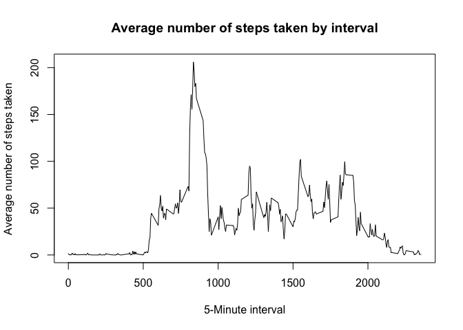

# Reproducible Research: Peer Assessment 1

### Assignment Instructions
Clone the GitHub repository (https://github.com/rdpeng/RepData_PeerAssessment1) created for this assignment.

* NOTE: The GitHub repository contains the dataset for the assignment so there is no need to download the data separately. It also contains details regarding this course project. 

Dataset: Activity monitoring data  
The variables included in this dataset are:

* **steps:** Number of steps taking in a 5-minute interval (missing values are coded as NA )
* **date:** The date on which the measurement was taken in YYYY-MM-DD format
* **interval:** Identifier for the 5-minute interval in which measurement was taken


### Loading and preprocessing the data
**Setup the working environment**

```r
        rm(list=ls(all=TRUE)) #clear the environment
        echo = TRUE #to include the code that used to generate the output
```


Read this dataset into a dataframe & inspect the data structure


```r
        unzip("activity.zip") #extract the csv file
        df = read.csv('activity.csv', header = T) #load data
        names(df)
```

```
## [1] "steps"    "date"     "interval"
```

```r
        str(df)
```

```
## 'data.frame':	17568 obs. of  3 variables:
##  $ steps   : int  NA NA NA NA NA NA NA NA NA NA ...
##  $ date    : Factor w/ 61 levels "2012-10-01","2012-10-02",..: 1 1 1 1 1 1 1 1 1 1 ...
##  $ interval: int  0 5 10 15 20 25 30 35 40 45 ...
```

```r
        head(df)
```

```
##   steps       date interval
## 1    NA 2012-10-01        0
## 2    NA 2012-10-01        5
## 3    NA 2012-10-01       10
## 4    NA 2012-10-01       15
## 5    NA 2012-10-01       20
## 6    NA 2012-10-01       25
```
### What is mean total number of steps taken per day?
Ignore missing values in dataset

1. Calculate the total number of steps taken per day

```r
        library(data.table)
        dt = data.table(df)
        dt_summary = dt[, list(total_steps = sum(steps, na.rm = T)), by = date]
        head(dt_summary)
```

```
##          date total_steps
## 1: 2012-10-01           0
## 2: 2012-10-02         126
## 3: 2012-10-03       11352
## 4: 2012-10-04       12116
## 5: 2012-10-05       13294
## 6: 2012-10-06       15420
```

```r
        tail(dt_summary)
```

```
##          date total_steps
## 1: 2012-11-25       11834
## 2: 2012-11-26       11162
## 3: 2012-11-27       13646
## 4: 2012-11-28       10183
## 5: 2012-11-29        7047
## 6: 2012-11-30           0
```

2. Make a histogram of the total number of steps taken each day

```r
        hist(dt_summary$total_steps, main="Total number of steps taken each day", 
        xlab="Total number of steps", breaks = 30, col="brown")
```


3. Calculate and report the mean and median of the total number of steps taken per day

```r
        mean_stepsValue <- mean(dt_summary$total_steps)  
        median_stepsValue <- median(dt_summary$total_steps)
        message(sprintf("Mean value of steps taken per day is %s", round(mean_stepsValue,0)))
```

```
## Mean value of steps taken per day is 9354
```

```r
        message(sprintf("Median value of steps taken per day is %s", median_stepsValue))
```

```
## Median value of steps taken per day is 10395
```

```r
        # Update the Histogram with Mean and Median lines and legends
        hist(dt_summary$total_steps, main="Total number of steps taken each day", 
        xlab="Total number of steps", breaks = 30, col="brown")
        
        abline(v=mean_stepsValue, lwd=4, col="dark blue")
        abline(v=median_stepsValue, lwd=4, col="dark green")
        
        legend("topright", lty=1, lwd=4, col=c("dark blue","dark green"), cex=.7, 
               legend = c(paste("Mean:", round(mean_stepsValue,0)), 
                          paste("Median:", median_stepsValue)))
```


### What is the average daily activity pattern?
* Make a time series plot (i.e. type = "l") of the 5-minute interval (x-axis) and the average number of steps taken, averaged across all days (y-axis)  

```r
        dt_summary_timeSeries = dt[, list(avg_steps = mean(steps, na.rm = T)), by = interval]
        head(dt_summary_timeSeries)
```

```
##    interval avg_steps
## 1:        0 1.7169811
## 2:        5 0.3396226
## 3:       10 0.1320755
## 4:       15 0.1509434
## 5:       20 0.0754717
## 6:       25 2.0943396
```

```r
        tail(dt_summary_timeSeries)
```

```
##    interval avg_steps
## 1:     2330 2.6037736
## 2:     2335 4.6981132
## 3:     2340 3.3018868
## 4:     2345 0.6415094
## 5:     2350 0.2264151
## 6:     2355 1.0754717
```

```r
        with(dt_summary_timeSeries, {
                plot(interval, avg_steps, type = "l",
                     main = "Average number of steps taken by interval",
                     xlab = "5-Minute interval",
                     ylab = "Average number of steps taken")
        })
```



* Which 5-minute interval, on average across all the days in the dataset, contains the maximum number of steps?  

```r
        max_steps = dt_summary_timeSeries[which.max(avg_steps),]
        message(sprintf("There are maximum of %s average steps taken on %sth Interval", round(max_steps$avg_steps,0), max_steps$interval))
```

```
## There are maximum of 206 average steps taken on 835th Interval
```
        


### Imputing missing values
1. Calculate and report the total number of missing values in the dataset (i.e. the total number of rows with NAs)

        


2. Devise a strategy for filling in all of the missing values in the dataset. The strategy does not need to be sophisticated. For example, you could use the mean/median for that day, or the mean for that 5-minute interval, etc.

** I am using mean value to replace each NA value in the steps column.**

3. Create a new dataset that is equal to the original dataset but with the missing data filled in.

```r
        str(dt)
```

```
## Classes 'data.table' and 'data.frame':	17568 obs. of  3 variables:
##  $ steps   : int  NA NA NA NA NA NA NA NA NA NA ...
##  $ date    : Factor w/ 61 levels "2012-10-01","2012-10-02",..: 1 1 1 1 1 1 1 1 1 1 ...
##  $ interval: int  0 5 10 15 20 25 30 35 40 45 ...
##  - attr(*, ".internal.selfref")=<externalptr>
```

```r
        setkey(dt, interval)
        setkey(dt_summary_timeSeries, interval)
        
        NA_replace = function(x,y){
                if(is.na(x)){
                        return(y)
                        }
                return(x)
                }

        
        dt_new = dt[dt_summary_timeSeries]
        dt_new$new_steps = mapply(NA_replace,dt_new$steps, dt_new$avg_steps)
        
        dt_new_summary = dt_new[, list(total_steps = sum(new_steps, na.rm = T)), by = date]
        head(dt_new_summary)
```

```
##          date total_steps
## 1: 2012-10-01    10766.19
## 2: 2012-10-02      126.00
## 3: 2012-10-03    11352.00
## 4: 2012-10-04    12116.00
## 5: 2012-10-05    13294.00
## 6: 2012-10-06    15420.00
```


4. Make a histogram of the total number of steps taken each day and Calculate and report the mean and median total number of steps taken per day. Do these values differ from the estimates from the first part of the assignment? What is the impact of imputing missing data on the estimates of the total daily number of steps?


```r
        hist(dt_new_summary$total_steps, main="Total number of steps taken each day - Missing Value replaced", 
        xlab="Total number of steps", breaks = 30, col="brown")
```


```r
        mean_stepsValue <- mean(dt_new_summary$total_steps)  
        median_stepsValue <- median(dt_new_summary$total_steps)
        message(sprintf("Mean value of steps taken per day is %s", round(mean_stepsValue,0)))
```

```
## Mean value of steps taken per day is 10766
```

```r
        message(sprintf("Median value of steps taken per day is %s", round(median_stepsValue,0)))
```

```
## Median value of steps taken per day is 10766
```

```r
        # Update the Histogram with Mean and Median lines and legends
        hist(dt_new_summary$total_steps, main="Total number of steps taken each day", 
        xlab="Total number of steps", breaks = 30, col="brown")
        
        abline(v=mean_stepsValue, lwd=4, col="dark blue")
        abline(v=median_stepsValue, lwd=4, col="dark green")
        
        legend("topright", lty=1, lwd=4, col=c("dark blue","dark green"), cex=.7, 
               legend = c(paste("Mean:", round(mean_stepsValue,0)), 
                          paste("Median:", round(median_stepsValue,0))))
```


### Are there differences in activity patterns between weekdays and weekends?
Use weekdays function

Create a new factor variable in the dataset with two levels – “weekday” and “weekend” indicating whether a given date is a weekday or weekend day.

```r
        weekpart = function(x){
        if(x %in% c('Saturday', 'Sunday')){
                return('Weekend')
                }

        return('Weekday')
        }
        
        dt_new$dayname = weekdays(as.Date(dt_new$date))
        dt_new$daytype = as.factor(apply(as.matrix(dt_new$dayname), 1, weekpart))
        dt_new_summary = dt_new[, list(avg_steps = mean(new_steps, na.rm = T)), by = list(interval, daytype)]
        str(dt_new_summary)
```

```
## Classes 'data.table' and 'data.frame':	576 obs. of  3 variables:
##  $ interval : int  0 0 5 5 10 10 15 15 20 20 ...
##  $ daytype  : Factor w/ 2 levels "Weekday","Weekend": 1 2 1 2 1 2 1 2 1 2 ...
##  $ avg_steps: num  2.2512 0.2146 0.4453 0.0425 0.1732 ...
##  - attr(*, ".internal.selfref")=<externalptr>
```
Make a panel plot containing a time series plot (i.e. type = "l") of the 5-minute interval (x-axis) and the average number of steps taken, averaged across all weekday days or weekend days (y-axis). See the README file in the GitHub repository to see an example of what this plot should look like using simulated data.


```r
library(lattice)
xyplot(avg_steps~interval | daytype, data = dt_new_summary,
      type = 'l',
      xlab = 'Interval',
      ylab = 'Number of Steps',
      layout = c(1,2))
```


